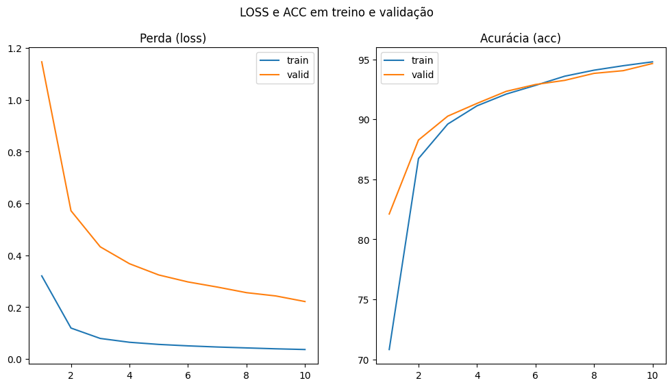
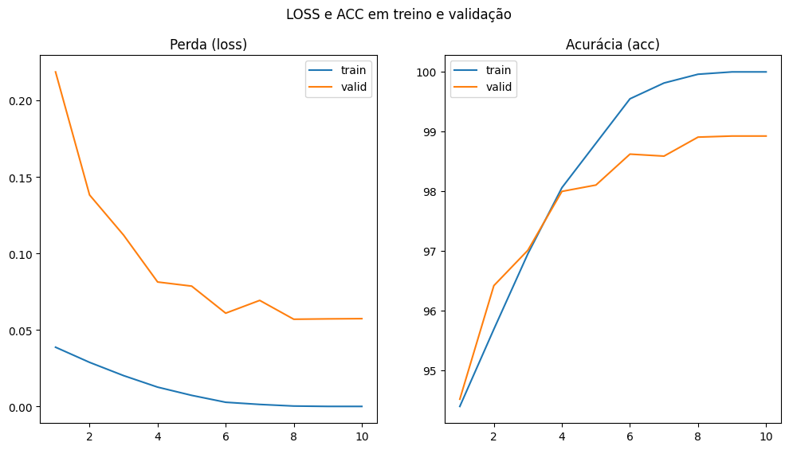
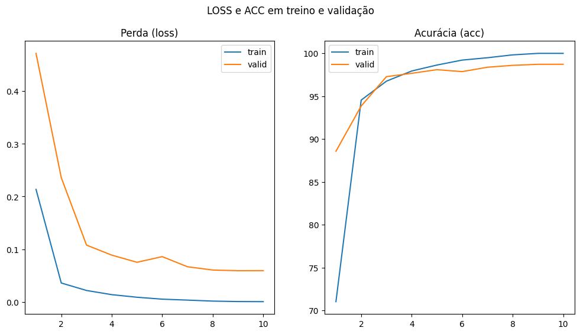
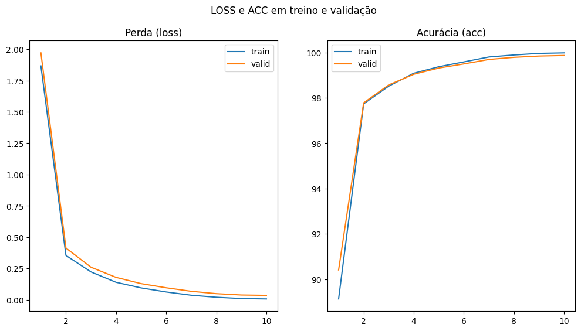

# Respostas questão 4
Vamos explorar modificações na arquitetura da rede ou no processo de treinamento para tentar melhorar ainda mais esse resultado. Explore diferentes otimizadores e taxa de aprendizado no modelo. Descreve o que foi observado com essas atualizações em relação ao processo de treinamento, validação e teste. Os modelos ficaram melhores?
Vamos apresentar várias configurações de arquitetura e buscar encontrar a melhor.

---

#### Estado inicial
``` python
class ConvNet(nn.Module):
    def __init__(self):
        super(ConvNet, self).__init__()
        self.layer1 = nn.Sequential(
            nn.Conv2d(1, 32, kernel_size=5, stride=1, padding=2),
            nn.ReLU(),
            nn.MaxPool2d(kernel_size=2, stride=2))
        self.layer2 = nn.Sequential(
            nn.Conv2d(32, 64, kernel_size=5, stride=1, padding=2),
            nn.ReLU(),
            nn.MaxPool2d(kernel_size=2, stride=2))
        self.fc1 = nn.Sequential(
            nn.Linear(7 * 7 * 64, 1000),
            nn.ReLU())
        self.fc2 = nn.Linear(1000, 10)

    def forward(self, x):
        out = self.layer1(x)
        out = self.layer2(out)
        out = out.reshape(out.size(0), -1)
        out = self.fc1(out)
        out = self.fc2(out)
        return out
```
**loss_fn** = nn.CrossEntropyLoss()
**learning_rate** = 0.001
**epochs** = 6
**optimizer** = Adam(model.parameters(), lr=learning_rate)

**A validação gerou:**
Época 1: acc: 95.70, loss: 0.1649
Época 2: acc: 97.28, loss: 0.1074
Época 3: acc: 97.85, loss: 0.0850
Época 4: acc: 97.56, loss: 0.1020
Época 5: acc: 97.25, loss: 0.1336
Época 6: acc: 97.66, loss: 0.1225

**Teste:**
Acurácia do Modelo em 10k imagens de teste: 97.74

---

#### Modificação 1: diminui lr
**Modificação:** 
epochs = 10
learning_rate = 0.00001

**A validação gerou:**
Época 1: acc: 82.11, loss: 1.1464
Época 2: acc: 88.28, loss: 0.5719
Época 3: acc: 90.27, loss: 0.4328
Época 4: acc: 91.33, loss: 0.3676
Época 5: acc: 92.34, loss: 0.3243
Época 6: acc: 92.91, loss: 0.2973
Época 7: acc: 93.25, loss: 0.2776
Época 8: acc: 93.83, loss: 0.2560
Época 9: acc: 94.06, loss: 0.2433
Época 10: acc: 94.66, loss: 0.2217

**Teste:**
Acurácia do Modelo em 10k imagens de teste: 94.84



**Vantagem ?**
O aprendizado do modelo esta mais constante, com learning rate menor os passos são mais curtos e o aprendizado é mais curto, o modelo atual, apresenta acurácia menor do que o inicial, contudo, em todas as épocas melhorou em relação as anteriores, ao contrário do primeiro que tinha aprendizado rápido mas incerto, diminuindo a acurácia em algumas épocas.

---

#### Modificação 2: scheduler no lr
**Modificação:** 
Adicionar um responsável por variar o leraning rate ao longo das épocas, fazê-lo crescer ajuda a sair de mínimos locais e diminuí-lo ajuda a convergir com mínimo globais.

**A validação gerou:**
Época  1: acc: 94.51, loss: 0.2187
Época  2: acc: 96.42, loss: 0.1383
Época  3: acc: 97.01, loss: 0.1120
Época  4: acc: 98.00, loss: 0.0814
Época  5: acc: 98.10, loss: 0.0787
Época  6: acc: 98.62, loss: 0.0610
Época  7: acc: 98.59, loss: 0.0694
Época  8: acc: 98.91, loss: 0.0570
Época  9: acc: 98.92, loss: 0.0573
Época 10: acc: 98.92, loss: 0.0574

**Teste:**
Acurácia do Modelo em 10k imagens de teste: 98.81



**Vantagem ?**

SIM, o modelo consegiu generalizar mais ainda, obteve melhor acurácia e perda de loss
---

#### Modificação 3: SGD com scheduler
**Modificação:** 
Aplicamos um novo otimizador com momentum e aumentamos o learning rate para 0.1, já que o scheduler garantirá sua variação. 
```python
learning_rate = 0.01
optimizer = SGD(model.parameters(), lr=learning_rate, momentum=0.9, nesterov=True)
```

**A validação gerou:**
Época 1: acc: 88.57, loss: 0.4717
Época 2: acc: 93.85, loss: 0.2358
Época 3: acc: 97.27, loss: 0.1078
Época 4: acc: 97.66, loss: 0.0887
Época 5: acc: 98.09, loss: 0.0752
Época 6: acc: 97.86, loss: 0.0859
Época 7: acc: 98.37, loss: 0.0667
Época 8: acc: 98.59, loss: 0.0604
Época 9: acc: 98.71, loss: 0.0592
Época 10: acc: 98.72, loss: 0.0593

**Teste:**
Acurácia do Modelo em 10k imagens de teste: 98.71



**Vantagem ?**
Sim, muito próximo da modificação anterior.

#### Modificação 4: consertar o tamanho dos dataloaders
**Modificação:** 
Durante todo o treinamento o dataset de treinamento era muito menor do que deveria ser (mulpa minha 😅)
No exercício doisa intensão era particionar o antigo daatset de treino em um de treino e de validação, eu ia colocar 83% dele no treino e 17% na validação mas ficou invertido... e mesmo assim o modelo alcançava acurácis muitos altas, incrível !
```python
# Exercício 2
from torch.utils.data import random_split

# Separação do dataset que era só de treino para também validação, 50_000 / 10_000
n = len(full_train_dataset)
valid_len = int(n * 0.17) # aqui estava 0.83!!!!
train_len = n - valid_len

train_dataset, validation_dataset = random_split(full_train_dataset, [train_len, valid_len])
``` 

**A validação gerou:**
Época 1: acc: 90.41, loss: 1.9717
Época 2: acc: 97.78, loss: 0.4125
Época 3: acc: 98.57, loss: 0.2592
Época 4: acc: 99.04, loss: 0.1781
Época 5: acc: 99.31, loss: 0.1282
Época 6: acc: 99.49, loss: 0.0950
Época 7: acc: 99.69, loss: 0.0669
Época 8: acc: 99.78, loss: 0.0482
Época 9: acc: 99.84, loss: 0.0374
Época 10: acc: 99.86, loss: 0.0345

**Teste:**
Acurácia do Modelo em 10k imagens de teste: 99.39



**Vantagem ?**
SIM, muita! Agora acerta quse tudo !

---

# Questão 6:
**Qual a diferença entre os modos model.train() e model.eval()? Por que é crucial usar model.eval() e com torch.no_grad() durante a fase de teste/avaliação?**
`model.eval()` garante que não haverá uso de Dropout e o BatchNorm será realizado com estatíticas gerais da seção de aprendizado. Ou seja, garante que estará pronto para inferências corretas e cnão calculará backpropagations.
`torch.no_grad()` faz com que resultados de cálculos que ajudam no backpropagation seja ignorados o que facilita e agiliza o processo de predição da fase de testes, em resumo, não há cálculo de gradientes.

---

# Questão 7:
**7 -  O dataset MNIST é um ótimo ponto de partida para aprendizado, mas é considerado um problema "resolvido".  Após o exemplo com o MNIST, explore o dataset Fashion-MNIST (60.000 imagens de treino, 10.000 de teste, 28x28 em escala de cinza, 10 classes). Empregue esse dataset para classificação.**
vide notebook fashio_mnist
